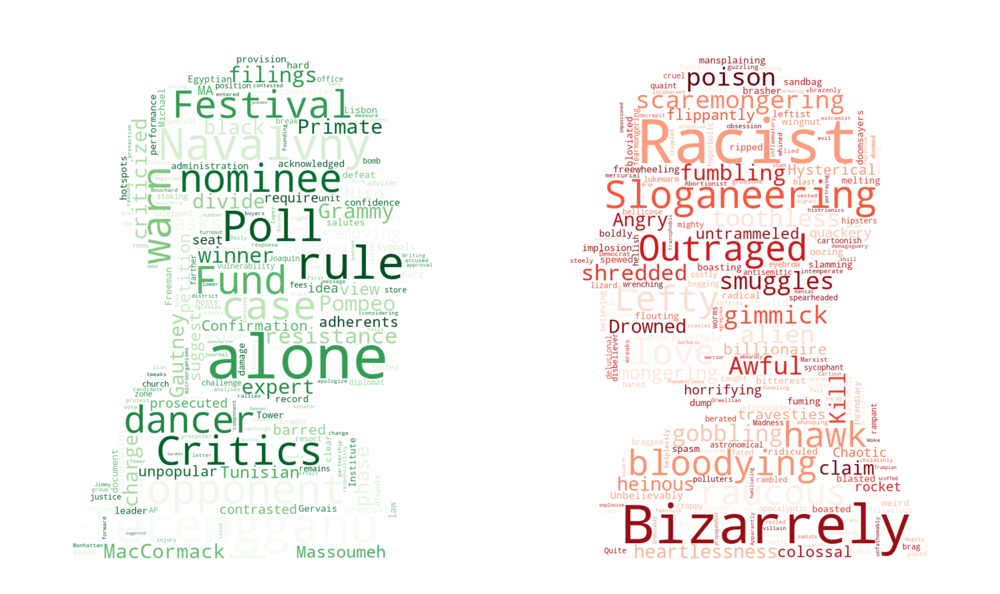

# Beyond the Surface: <span style="background-color: #e3aab0;">Spurious</span> Cues in <span style="background-color: #8fb38f;">Automatic</span> Media <span style="background-color: #d47b7c;">Bias</span> Detection


## Overview

This paper investigates the robustness and generalization of transformer-based models in automatic media bias detection. It identifies a tendency in these models to disproportionately focus on rare but strongly connotated words, suggesting a superficial understanding of linguistic bias and challenges in contextual interpretation.


## Table of Contents

- [Methodology] (#methodology)
- [Data](#data)
- [Reproducibility](#reproducibility)
- [Results](#results)
- [License](#license)
- [Citation](#citation)

## Methodology

- **Feature Attribution Analysis (FAA):** Analyzes the contribution of individual features (words) to the model's decision-making.
- **Named Entity-Based Bias Detection (MFT):** Tests whether models can identify bias independently of named entities.
- **Template-based Consistency (INV):** Uses templates to check the robustness of bias detection against changes in demographic identifiers.
- **Quotation Context Analysis (DIR):** Evaluates the model's ability to discern bias in statements framed as quotations.

## Data

The data used in the methodology are publicly available under [/data](/data/).

## Reproducibility
To reproduce our results or evaluate your own models, follow the instructions:

1. install dependencies
```
pip install -r requirements.txt
```
2. Run the feature attribution analysis

- extract the attributions

    ```
    python src/scripts/get_feature_attributions.py
    ```
- visualize the results
    ```
    python src/scripts/visualize_attributions.py
    ```

3. Stress-test the model
    ```
    chmod +x src/scripts/stress-test.sh ; ./src/scripts/stress-test.sh
    ```

## Results


| Category                                  | F1-Score |
|-------------------------------------------|----------|
| **Gender**                                | **0.70** |
| &nbsp;&nbsp;&nbsp;&nbsp; Male             | 0.68     |
| &nbsp;&nbsp;&nbsp;&nbsp; Female           | 0.75     |
| &nbsp;&nbsp;&nbsp;&nbsp; Non-Binary       | 0.69     |
| **Origin**                                | **0.98** |
| &nbsp;&nbsp;&nbsp;&nbsp; European         | 0.94     |
| &nbsp;&nbsp;&nbsp;&nbsp; African          | 0.99     |
| &nbsp;&nbsp;&nbsp;&nbsp; Asian            | 1.00     |
| **Religion**                              | **0.86** |
| &nbsp;&nbsp;&nbsp;&nbsp; Christianity     | 0.89     |
| &nbsp;&nbsp;&nbsp;&nbsp; Islam            | 0.89     |
| &nbsp;&nbsp;&nbsp;&nbsp; Atheism          | 0.80     |
| **Disability**                            | **0.84** |
| &nbsp;&nbsp;&nbsp;&nbsp; Physical         | 0.84     |
| &nbsp;&nbsp;&nbsp;&nbsp; Sensory          | 0.77     |
| &nbsp;&nbsp;&nbsp;&nbsp; Neurodevelopmental and Mental Health | 0.86 |
| **Political Affiliation (Politician Names)** | **0.92** |
| &nbsp;&nbsp;&nbsp;&nbsp; Conservatives    | 0.97     |
| &nbsp;&nbsp;&nbsp;&nbsp; Liberals         | 0.91     |
| &nbsp;&nbsp;&nbsp;&nbsp; Socialists       | 0.89     |
| **Political Affiliation**                 | **0.86** |
| &nbsp;&nbsp;&nbsp;&nbsp; Left-wing (liberal/progressive) | 0.91 |
| &nbsp;&nbsp;&nbsp;&nbsp; Right-wing (conservative) | 0.80 |
| &nbsp;&nbsp;&nbsp;&nbsp; Centrist (Moderate) | 0.88   |
| **Occupation**                            | **0.67** |
| &nbsp;&nbsp;&nbsp;&nbsp; Services         | 0.70     |
| &nbsp;&nbsp;&nbsp;&nbsp; Creative Arts and Media | 0.68 |
| &nbsp;&nbsp;&nbsp;&nbsp; Skilled Trades and Manual Labour | 0.64 |


## License

This project is licensed under the [MIT License](LICENSE). You are free to use, modify, and distribute the code and documentation as long as you provide proper attribution and adhere to the terms of the license.

## Citation

`# anonymous period`
